# 🌿 RootCause

> This assignment prompt was shared by **Prathamesh Sir**.

RootCause is an AI-powered web application designed for terrace and balcony gardeners. Users can upload an image of a plant's leaf or root to receive an AI-generated diagnosis, treatment recommendations, and purchase suitable products directly through an integrated shop.

---

# 🚀 Live Demo

**Live Website:** https://rootcause-369.vercel.app

**GitHub Repository:** https://github.com/priyanshuyadav369/rootcause

---

# 📖 Project Overview

Maintaining healthy plants can be difficult for beginners, especially when diseases or nutrient deficiencies appear. RootCause simplifies plant care by using AI to analyze plant images, identify potential issues, recommend treatments, and maintain a complete health record for every plant.

The application combines modern AI services with a complete plant management system, analytics dashboard, and online shopping experience to provide an all-in-one solution for gardeners.

---

# ✅ Mandatory Requirements Implemented

- ✔ Supabase Authentication
- ✔ Protected Routes
- ✔ CRUD Operations (My Plants)
- ✔ CRUD Operations (Orders)
- ✔ Analytics Dashboard using Recharts
- ✔ Landing Page with Responsive UI
- ✔ Supabase Database Integration
- ✔ Groq AI Chat Assistant
- ✔ Groq Vision Image Diagnosis
- ✔ Resend Email Integration
- ✔ GitHub Repository
- ✔ Vercel Deployment

---

# ✨ Features

- Secure Email/Password Authentication using Supabase
- Protected Routes for authenticated users
- Manage Plant Records (Create, Read, Update, Delete)
- AI-powered Plant Disease Detection
- Plant Diagnosis using Groq Vision
- AI Chat Assistant for Gardening Questions
- Integrated Shop with Cart and Orders
- Analytics Dashboard with Interactive Charts
- Weekly Email Reports using Resend
- Fully Responsive User Interface

---

# 🛠 Tech Stack

| Layer | Technology |
|-------|------------|
| Frontend | React + Vite |
| Routing | React Router |
| Styling | Tailwind CSS |
| Authentication | Supabase Auth |
| Database | Supabase |
| Storage | Supabase Storage |
| AI Vision | Groq Vision |
| AI Chat | Groq LLM |
| Charts | Recharts |
| Email | Resend |
| Deployment | Vercel |

---

# 📷 Project Screenshots

| Page | Screenshot |
|------|------------|
| Landing Page | 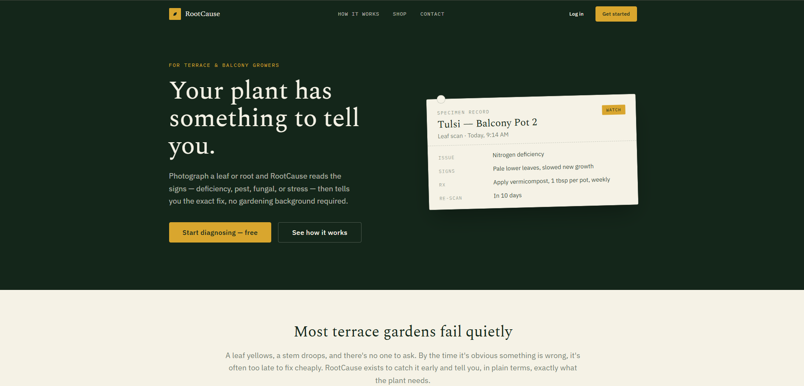 |
| Login | 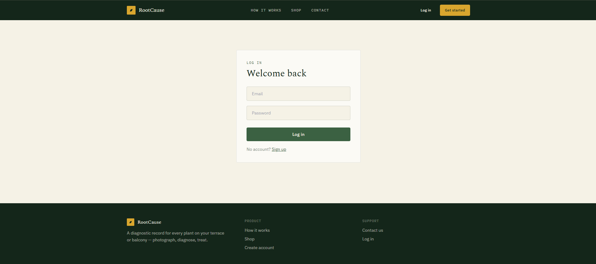 |
| Sign Up | 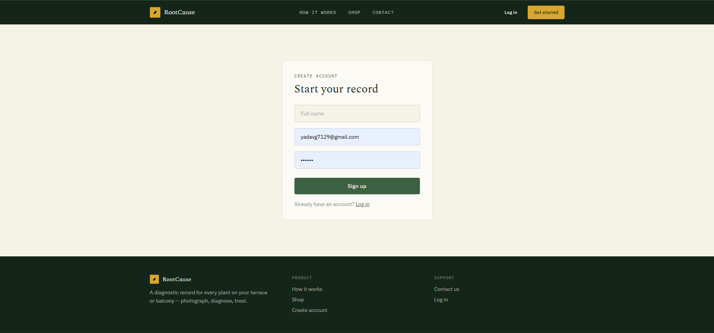 |
| Dashboard | 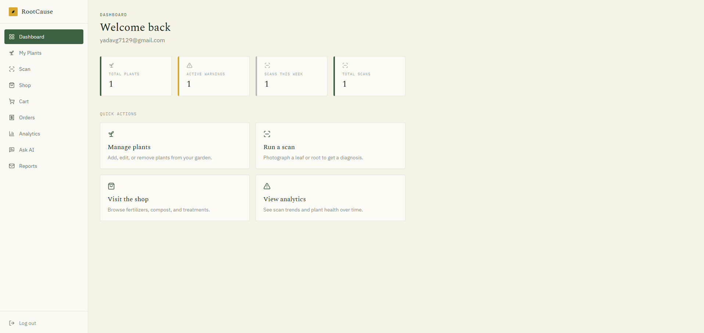 |
| My Plants | 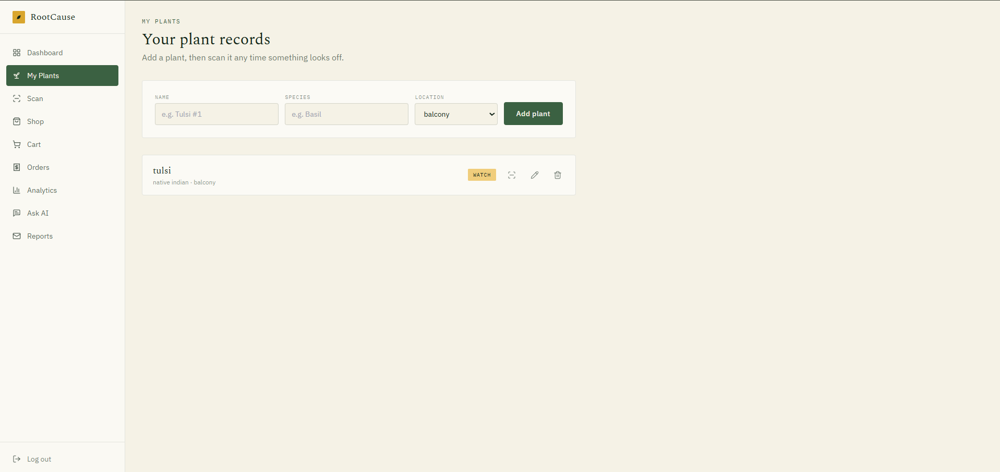 |
| Scan & Diagnosis | 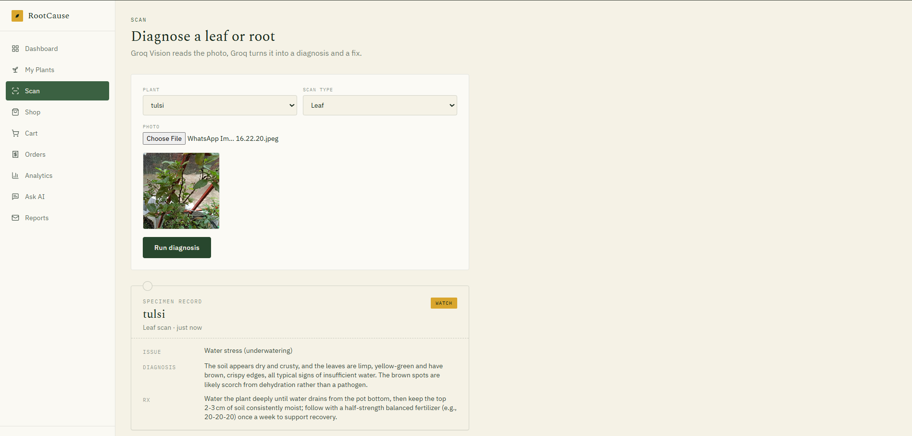 |
| Shop | 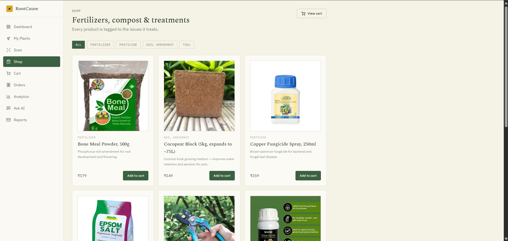 |
| Orders | 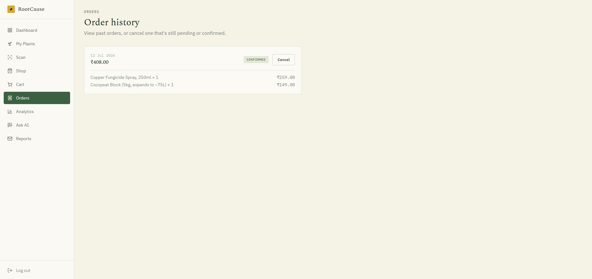 |
| Analytics Dashboard | 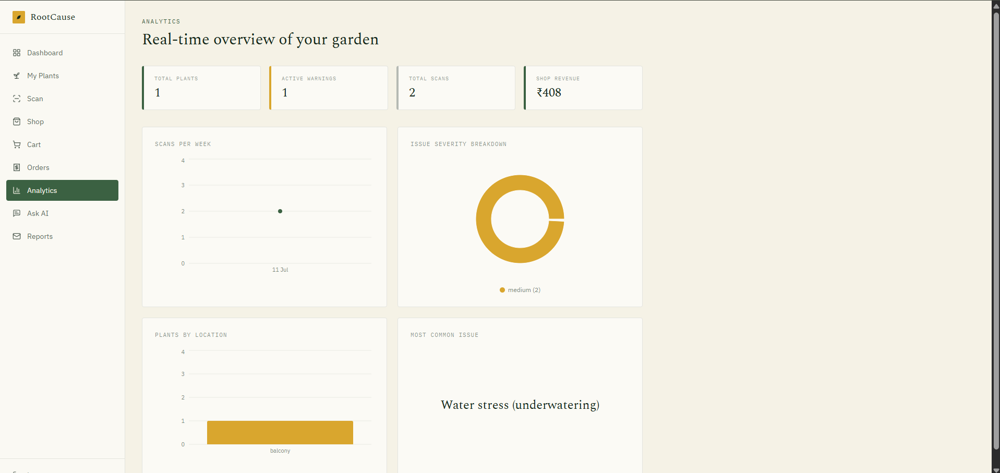 |
| Ask AI | 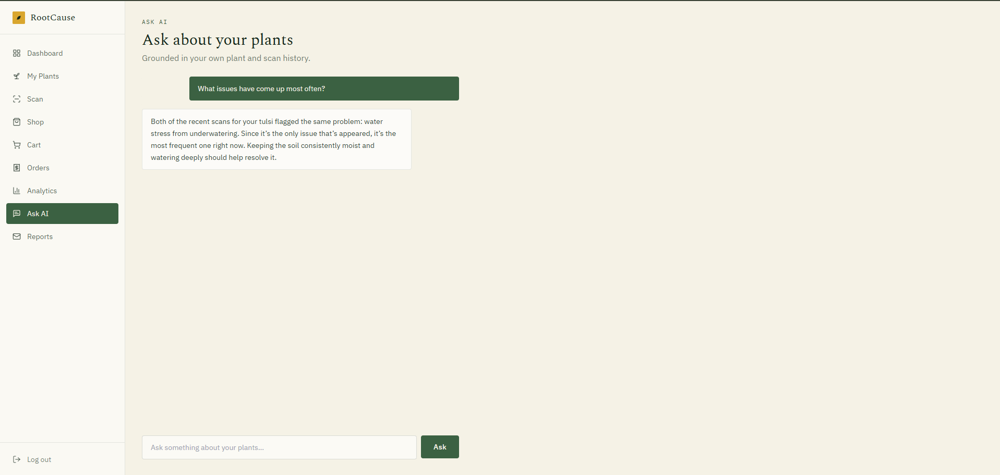 |
| Reports | 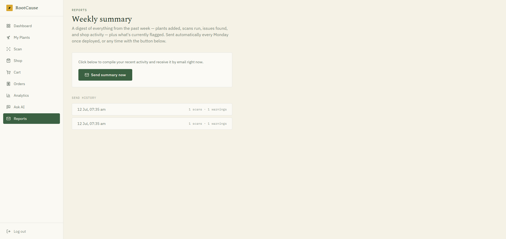 |

---

# 📂 Project Structure

```
rootcause
│
├── api
├── public
├── screenshots
├── src
│   ├── assets
│   ├── components
│   ├── contexts
│   ├── hooks
│   ├── layouts
│   ├── lib
│   ├── pages
│   ├── routes
│   └── utils
│
├── supabase
├── .env.example
├── package.json
├── vite.config.js
└── README.md
```

---

# ⚙️ Getting Started

Clone the repository

```bash
git clone https://github.com/priyanshuyadav369/rootcause.git
```

Navigate to the project

```bash
cd rootcause
```

Install dependencies

```bash
npm install
```

Create the environment file

```bash
cp .env.example .env
```

Fill in the required environment variables:

```
VITE_SUPABASE_URL
VITE_SUPABASE_ANON_KEY
VITE_GROQ_API_KEY
RESEND_API_KEY
SUPABASE_SERVICE_ROLE_KEY
```

Run the development server

```bash
npm run dev
```

---

# 🚀 Deployment

The project is deployed on **Vercel**.

Deployment Steps:

1. Push the repository to GitHub.
2. Import the repository into Vercel.
3. Configure all environment variables from `.env.example`.
4. Deploy the project.

Live URL:

**https://rootcause-369.vercel.app**

---

# 📊 Analytics

The Analytics Dashboard provides graphical insights using **Recharts**, including:

- Plant Health Distribution
- Scan History
- Disease Frequency
- Plant Status Overview
- User Activity

---

# 🤖 AI Services

### Groq Vision

- Image-based disease detection
- Leaf and root analysis
- Treatment recommendations

### Groq AI

- Gardening assistant
- Plant care suggestions
- Context-aware responses

---

# 📧 Email Reports

Using **Resend**, users can:

- Send reports manually
- Receive weekly summaries
- Review scan and plant activity

---

# 📌 Project Status

✅ **Completed**

All mandatory project requirements have been successfully implemented.

The application includes:

- Supabase Authentication
- Protected Routes
- Multiple CRUD Modules
- Analytics Dashboard
- Groq AI
- Groq Vision
- Resend Integration
- Responsive Landing Page
- GitHub Repository
- Live Deployment on Vercel

---

# 👨‍💻 Author

**Priyanshu Yadav**

GitHub: https://github.com/priyanshuyadav369

---

# 🙏 Acknowledgement

This project was developed as part of the **Major Project / Product Development Assignment**.

The assignment prompt was shared by **Prathamesh Sir**.

---

# 📄 License

This project is intended for educational purposes.